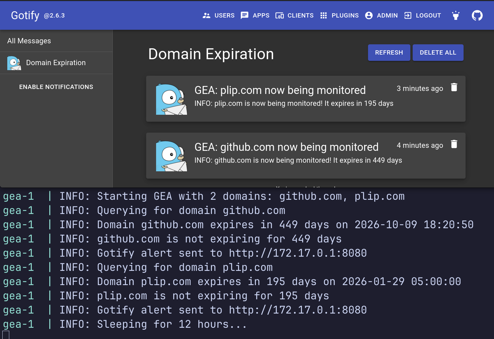
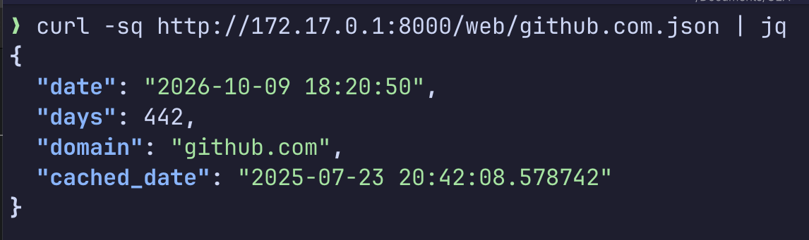

# GEA

Gotify (Domain) Expiration Alerter (GEA) is a single function docker service that checks if a domain's registration expires in less than N days. If yes, an alert is sent to your Gotify instance.



Additionally, it exposes a web server that servers JSON status of any domain being monitored.  This is good to use with projects like [Uptime Kuma](https://uptime.kuma.pet/) which can send alerts based on JSON values in HTTP `GET` calls:



There's number of [existing project](#related-projects) that might meet your needs! This project good if you want to run it in docker, only have a few domains to monitor and use Gotify for alerts.

## Prerequisites 

* Domain you want to monitor the expiration of
* [Gotify](https://gotify.net/) instance

## Tech stack

This project is really just glue between a few existing solutions. By leveraging actively developed libraries around the `whois` service, hopefully it will work for a large collection of domains:

* Alerts: [Gotify](https://gotify.net/)
* Expiration from `whois`: [Python `whois` library](https://github.com/richardpenman/whois) 
* Infra: [Docker Compose](https://docs.docker.com/compose/)
* OS: [Python 3 Alpine 3.21 image](https://hub.docker.com/layers/library/python/3-alpine3.22/images/sha256-778926a6529b5f41161c65f0b4cbb0cabaab8d597051d3504b3b207f21a0a58e) (only 16MB \o/)

## Setup

1. Check out this repo: `git clone https://github.com/mrjones-pliop/GEA.git`
2. Copy the `exmple.env` to `.env`
3. Log into your Gotify instance and [create a token](https://gotify.net/docs/pushmsg) 
4. Edit `.env` to have your Gotify URL, Gotify token and domain(s) you want to monitor:
    ```shell
   GOTIFY_URL="https://gotify.example.com"
   GOTIFY_TOKEN="https://gotify.example.com"
   MONITOR_DOMAINS="github.com,plip.com"
   WARN_DAYS=10
   ```
5. Start docker to start domain monitoring: `docker compose up -d` 
6. You should get a confirmation alert that monitoring is set up and when the domain(s) will expire so you know everything is working

## Related projects

My partner suggests, "A whole Docker app?!  What about just setting a yearly [Task reminder in Google](https://support.google.com/tasks/answer/7675772?hl=en) - that'll only take 30 seconds to do." This may be the simplest way forward!

Otherwise, I was unable to find an existing docker based service to easily send an alert to Gotify when a domain is expiring.  There's a Go based project "[domain-monitor](https://github.com/nwesterhausen/domain-monitor)" that does 100% of everything I was looking for, but sends email alerts instead of Gotify alerts.  If you want email alerts, I suspect this would be the way to go. It looks be very mature having started in 2020 and is on version `1.24` ad of now (Jul 2025). I don't know Go :/

Another good idea might to use [Nagios](https://support.nagios.com/forum/viewtopic.php?t=61028) - a gold standard in monitoring.

A very full featured self-hosted solution is likely [DomainMOD](https://domainmod.org/) which appears to do it _all_ and then some, but is geared towards managing dozens, or more, of domains.    

There's some SaaS offerings that appear to do it:
* [Uptime Robot](https://uptimerobot.com/domain-expiration-monitoring/)
* [Zabbix](https://blog.devgenius.io/monitoring-domain-expiry-with-zabbix-and-python-32c9952b6794)
* [Pinger Man](https://pingerman.com/monitoring/domain)
* [Uptimia](https://www.uptimia.com/domain-monitoring)
* [Uptime Beats](https://uptimebeats.com/tools/domain-expiry-checker)

Then there are GH projects I saw but passed over as they're older or too broad scoped :
* [alertmanager_gotify_bridge](https://github.com/DRuggeri/alertmanager_gotify_bridge) 
* [Nice Domain](https://www.nicedomain.com/blog/domain-names/domain-name-expiration-notifications-and-reminders/)
* [Domain Hunter](https://github.com/threatexpress/domainhunter)
* [xcname](https://github.com/mandatoryprogrammer/xcname)
* [dns-domain-expiration-checker](https://github.com/Matty9191/dns-domain-expiration-checker)
* [action-check-domain](https://github.com/codex-team/action-check-domain)
* [pythonwhois](https://github.com/joepie91/python-whois)

Existing, [similar DIY solutions](https://solutionamardba.medium.com/monitoring-domain-expiry-and-domain-ssl-status-for-100-of-domains-and-save-in-csv-part-ii-ff87317d8220) have you write python and, well, here I am DIYing it for you so you don't have to DIY ;)