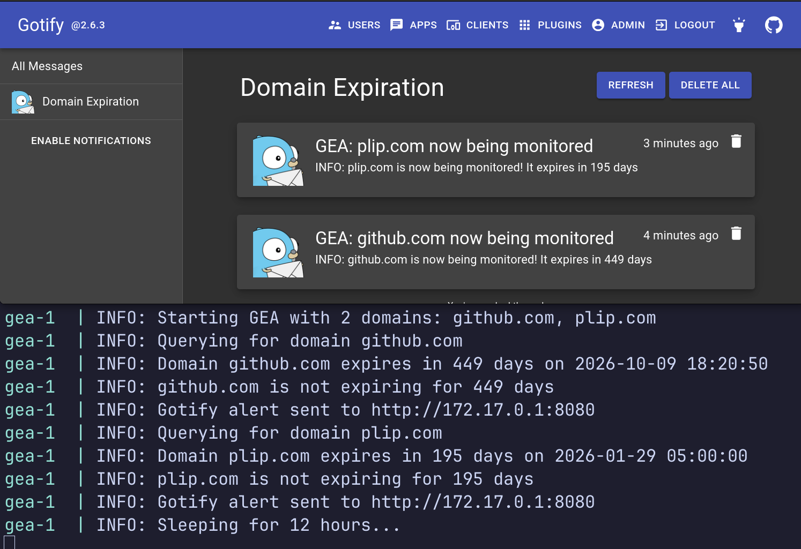
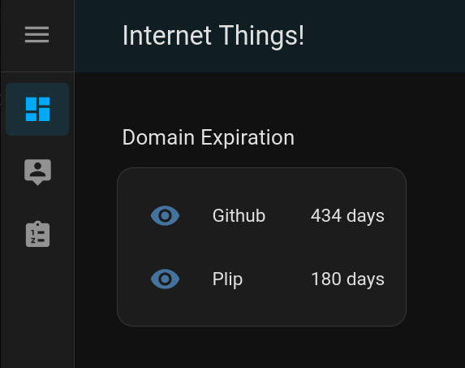
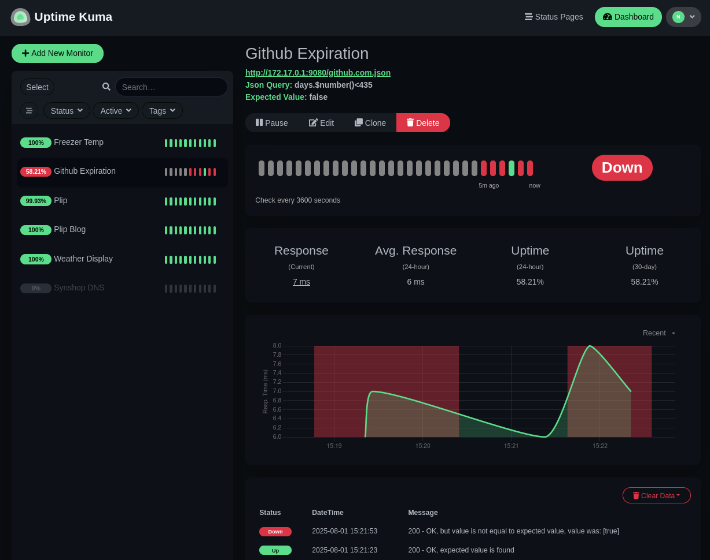

# GEA

Gotify (Domain) Expiration Alerter (GEA) is a docker service that checks if a domain's registration expires in less than N days. If yes, an alert is sent to your Gotify instance.

Additionally, it exposes a web server that serves JSON statuses of any domain being monitored.  This is handy for:
* [Uptime Kuma](https://uptime.kuma.pet/): monitor and alert via existing means when your domain(s) expire 
* [Home Assistant](https://www.home-assistant.io/): show days until your domain(s) expire

Here's what it looks like to get alerts acknowledging GEA is started in Gotify (top) and showing the logs in Docker (bottom):



## Wait! Is this a terrible idea for me to deploy?

Maybe! 

There's number of [existing projects](#related-projects) that might meet your needs. Check their first.

Continue on if you want to run a small docker service, only have a few domains to monitor and use Gotify for alerts (and possibly HA and/or Uptime Kuma).


## Install

### Prerequisites 

* Domain you want to monitor the expiration of
* [Gotify](https://gotify.net/) instance
* [Docker](https://docs.docker.com/) installed

### Install

1. Check out this repo: `git clone https://github.com/mrjones-pliop/GEA.git`
2. Copy the `exmple.env` to `.env`
3. Log into your Gotify instance and [create a token](https://gotify.net/docs/pushmsg) 
4. Edit `.env` to have your Gotify URL, Gotify token and domain(s) you want to monitor. Be sure that you update `GOTIFY_URL` be your Gotify URL and that it is accessible from your docker instance.  :
    ```shell
   GOTIFY_URL="http://172.17.0.1:8000"
   GOTIFY_TOKEN="A.T9cF1UxmSU6J9"
   SEND_ALERTS=Yes-please! # delete this line to not send alerts
   MONITOR_DOMAINS="github.com, plip.com"
   WARN_DAYS=10
   PORT=8000
   ```
5. Start docker to begin domain monitoring: `docker compose up -d` 
6. You should get a confirmation alert that monitoring is set up and when the domain(s) will expire so you know everything is working

### Web server

After you've called `docker compose up -d`, a web server starts on port `9080`.  There's a file per domain being followed.  If you were monitoring `github.com` you would add on `.json` to see the results.  Here's a call of `curl` piped to `jq` to show the results:

```commandline
curl -qs http://172.17.0.1:9080/github.com.json |jq
```

The output is:

```json
{
  "date": "2026-10-09 18:20:50",
  "days": 434,
  "domain": "github.com",
  "cached_date": "2025-08-01 16:18:56.393527"
}
```

### Home Assistant

If you run [Home Assistant](https://www.home-assistant.io/) you can have a list of domain expirations that looks like this:



I'm not the most savvy HA user, but by referencing their [RESTful API docs](https://www.home-assistant.io/integrations/sensor.rest) I was able to cobble together this config which I could then use to add to a dashboard (as shown above):

```yaml
rest:
  - scan_interval: 3600
    resource: http://172.17.0.1:9080/plip.com.json
    sensor:
      - name: "Plip"
        value_template: "{{ value_json['days'] }}"
        state_class: measurement
        unit_of_measurement: 'days'
  - scan_interval: 3600
    resource: http://172.17.0.1:9080/github.com.json
    sensor:
      - name: "Github"
        value_template: "{{ value_json['days'] }}"
        state_class: measurement
        unit_of_measurement: 'days'
```

For the `resource`, be sure to use the URL or IP for where your GEA is running via docker.

### Uptime Kuma

If you run [Uptime Kuma](https://uptime.kuma.pet/) you can monitor and alert on your domain expirations. Here I've set it to alert to one more day than the domain is valid for (`435`) so the alert is triggered:



This done using the [JSON values](https://github.com/louislam/uptime-kuma/pull/3253) feature.  When adding a new monitor, I used these values:
  * Monitor Type: `HTTP(s) Json Query`
  * URL: `http://172.17.0.1:9080/github.com.json` - Be sure to use the URL or IP for where your GEA is running via docker.
  * Json Query: `days.$number()<10` - Set the `10` to be the days remaining in the domain before it sets an alert.
  * Expected Value: "false"

All other values are OK at their defaults.

## Tech stack

This project is really just glue between a few existing solutions. By leveraging actively developed libraries around the `whois` service, hopefully it will work for a large collection of domains:

* Alerts: [Gotify](https://gotify.net/)
* Expiration from `whois`: [Python `whois` library](https://github.com/richardpenman/whois) 
* Infra: [Docker Compose](https://docs.docker.com/compose/)
* OS 1: [Python 3 Alpine 3.21 image](https://hub.docker.com/layers/library/python/3-alpine3.22/images/sha256-778926a6529b5f41161c65f0b4cbb0cabaab8d597051d3504b3b207f21a0a58e) (only 16MB \o/) - this to use the `whois` library and cache the results
* OS 2: [Busybox latest image](https://hub.docker.com/layers/library/busybox/stable/images/sha256-88fc722c54c256ed1f13cc9f2f89ffc6cea57346b43d92217a678ca09fdd4d58) (only 2MB!!! \o/) - this to serve up the cached JSON files

## Related projects

My partner suggests, "A whole Docker app?!  What about just setting a yearly [Task reminder in Google](https://support.google.com/tasks/answer/7675772?hl=en) - that'll only take 30 seconds to do." This may be the simplest way forward!

Otherwise, I was unable to find an existing docker based service to easily send an alert to Gotify when a domain is expiring.  There's a Go based project "[domain-monitor](https://github.com/nwesterhausen/domain-monitor)" that does 100% of everything I was looking for, but sends email alerts instead of Gotify alerts.  If you want email alerts, I suspect this would be the way to go. It looks be very mature having started in 2020 and is on version `1.24` ad of now (Jul 2025). I don't know Go :/

Another good idea might to use [Nagios](https://support.nagios.com/forum/viewtopic.php?t=61028) - a gold standard in monitoring.

A very full-featured self-hosted solution is likely [DomainMOD](https://domainmod.org/) which appears to do it _all_ and then some, but is geared towards managing dozens, or more, of domains.    

There's some SaaS offerings that appear to do it:
* [Uptime Robot](https://uptimerobot.com/domain-expiration-monitoring/)
* [Zabbix](https://blog.devgenius.io/monitoring-domain-expiry-with-zabbix-and-python-32c9952b6794)
* [Pinger Man](https://pingerman.com/monitoring/domain)
* [Uptimia](https://www.uptimia.com/domain-monitoring)
* [Uptime Beats](https://uptimebeats.com/tools/domain-expiry-checker)

Then there are GH projects I saw but passed over as they're older or too broad scoped :
* [alertmanager_gotify_bridge](https://github.com/DRuggeri/alertmanager_gotify_bridge) 
* [Nice Domain](https://www.nicedomain.com/blog/domain-names/domain-name-expiration-notifications-and-reminders/)
* [Domain Hunter](https://github.com/threatexpress/domainhunter)
* [xcname](https://github.com/mandatoryprogrammer/xcname)
* [dns-domain-expiration-checker](https://github.com/Matty9191/dns-domain-expiration-checker)
* [action-check-domain](https://github.com/codex-team/action-check-domain)
* [pythonwhois](https://github.com/joepie91/python-whois)

Existing, [similar DIY solutions](https://solutionamardba.medium.com/monitoring-domain-expiry-and-domain-ssl-status-for-100-of-domains-and-save-in-csv-part-ii-ff87317d8220) have you write python and, well, here I am DIYing it for you so you don't have to DIY ;)